hw01-Aummul-Manasawala
================
Aummul Baneen Manasawala
February 19, 2018

2 Data Import
=============

### Importing data with read.csv()

``` r
 url <- 'https://archive.ics.uci.edu/ml/machine-learning-databases/autos/imports-85.data'

column_names <- c(
                  "symboling",
                  "normalized_losses",
                   "make",
                  "fuel_type",
                  "aspiration",
                  "num_of_doors",
                  "body_style",
                  "drive_wheels",
                  "engine_location",
                  "wheel_base",
                  "length",
                  "width",
                  "height",
                  "curb_weight",
                  "engine_type",
                  "num_of_cylinders",
                  "engine_size",
                  "fuel_system",
                  "bore",
                  "stroke",
                  "compression_ratio",
                  "horsepower",
                  "peak_rpm",
                  "city_mpg",
                  "highway_mpg",
                  "price"
                  )


column_type <- c(
  "double",
  "double",
  "character",
  "character",
  "character",
  "character",
  "character",
  "character",
  "character", 
  "double", 
  "double",
  "double",
  "double",
  "integer",
  "character",
  "character",
  "integer",
  "character",
  "double",
  "double",
  "double",
  "integer",
  "integer",
  "integer",
  "integer",
  "integer"
)

automobile <- read.csv(url, col.names = column_names, colClasses  = column_type, stringsAsFactors = FALSE, skipNul = FALSE, na.string = "?", header = FALSE) 
```

### Display of structure

``` r
str(automobile)
```

    ## 'data.frame':    205 obs. of  26 variables:
    ##  $ symboling        : num  3 3 1 2 2 2 1 1 1 0 ...
    ##  $ normalized_losses: num  NA NA NA 164 164 NA 158 NA 158 NA ...
    ##  $ make             : chr  "alfa-romero" "alfa-romero" "alfa-romero" "audi" ...
    ##  $ fuel_type        : chr  "gas" "gas" "gas" "gas" ...
    ##  $ aspiration       : chr  "std" "std" "std" "std" ...
    ##  $ num_of_doors     : chr  "two" "two" "two" "four" ...
    ##  $ body_style       : chr  "convertible" "convertible" "hatchback" "sedan" ...
    ##  $ drive_wheels     : chr  "rwd" "rwd" "rwd" "fwd" ...
    ##  $ engine_location  : chr  "front" "front" "front" "front" ...
    ##  $ wheel_base       : num  88.6 88.6 94.5 99.8 99.4 ...
    ##  $ length           : num  169 169 171 177 177 ...
    ##  $ width            : num  64.1 64.1 65.5 66.2 66.4 66.3 71.4 71.4 71.4 67.9 ...
    ##  $ height           : num  48.8 48.8 52.4 54.3 54.3 53.1 55.7 55.7 55.9 52 ...
    ##  $ curb_weight      : int  2548 2548 2823 2337 2824 2507 2844 2954 3086 3053 ...
    ##  $ engine_type      : chr  "dohc" "dohc" "ohcv" "ohc" ...
    ##  $ num_of_cylinders : chr  "four" "four" "six" "four" ...
    ##  $ engine_size      : int  130 130 152 109 136 136 136 136 131 131 ...
    ##  $ fuel_system      : chr  "mpfi" "mpfi" "mpfi" "mpfi" ...
    ##  $ bore             : num  3.47 3.47 2.68 3.19 3.19 3.19 3.19 3.19 3.13 3.13 ...
    ##  $ stroke           : num  2.68 2.68 3.47 3.4 3.4 3.4 3.4 3.4 3.4 3.4 ...
    ##  $ compression_ratio: num  9 9 9 10 8 8.5 8.5 8.5 8.3 7 ...
    ##  $ horsepower       : int  111 111 154 102 115 110 110 110 140 160 ...
    ##  $ peak_rpm         : int  5000 5000 5000 5500 5500 5500 5500 5500 5500 5500 ...
    ##  $ city_mpg         : int  21 21 19 24 18 19 19 19 17 16 ...
    ##  $ highway_mpg      : int  27 27 26 30 22 25 25 25 20 22 ...
    ##  $ price            : int  13495 16500 16500 13950 17450 15250 17710 18920 23875 NA ...

### Importing data with read\_csv()

``` r
library(readr)
library(curl)
```

    ## 
    ## Attaching package: 'curl'

    ## The following object is masked from 'package:readr':
    ## 
    ##     parse_date

``` r
automobile2 <- read_csv(url, col_names = column_names, col_types = 'ddcccccccddddiccicdddiiiii', na = "?")
```

### Display of structure

``` r
str(automobile2)
```

    ## Classes 'tbl_df', 'tbl' and 'data.frame':    205 obs. of  26 variables:
    ##  $ symboling        : num  3 3 1 2 2 2 1 1 1 0 ...
    ##  $ normalized_losses: num  NA NA NA 164 164 NA 158 NA 158 NA ...
    ##  $ make             : chr  "alfa-romero" "alfa-romero" "alfa-romero" "audi" ...
    ##  $ fuel_type        : chr  "gas" "gas" "gas" "gas" ...
    ##  $ aspiration       : chr  "std" "std" "std" "std" ...
    ##  $ num_of_doors     : chr  "two" "two" "two" "four" ...
    ##  $ body_style       : chr  "convertible" "convertible" "hatchback" "sedan" ...
    ##  $ drive_wheels     : chr  "rwd" "rwd" "rwd" "fwd" ...
    ##  $ engine_location  : chr  "front" "front" "front" "front" ...
    ##  $ wheel_base       : num  88.6 88.6 94.5 99.8 99.4 ...
    ##  $ length           : num  169 169 171 177 177 ...
    ##  $ width            : num  64.1 64.1 65.5 66.2 66.4 66.3 71.4 71.4 71.4 67.9 ...
    ##  $ height           : num  48.8 48.8 52.4 54.3 54.3 53.1 55.7 55.7 55.9 52 ...
    ##  $ curb_weight      : int  2548 2548 2823 2337 2824 2507 2844 2954 3086 3053 ...
    ##  $ engine_type      : chr  "dohc" "dohc" "ohcv" "ohc" ...
    ##  $ num_of_cylinders : chr  "four" "four" "six" "four" ...
    ##  $ engine_size      : int  130 130 152 109 136 136 136 136 131 131 ...
    ##  $ fuel_system      : chr  "mpfi" "mpfi" "mpfi" "mpfi" ...
    ##  $ bore             : num  3.47 3.47 2.68 3.19 3.19 3.19 3.19 3.19 3.13 3.13 ...
    ##  $ stroke           : num  2.68 2.68 3.47 3.4 3.4 3.4 3.4 3.4 3.4 3.4 ...
    ##  $ compression_ratio: num  9 9 9 10 8 8.5 8.5 8.5 8.3 7 ...
    ##  $ horsepower       : int  111 111 154 102 115 110 110 110 140 160 ...
    ##  $ peak_rpm         : int  5000 5000 5000 5500 5500 5500 5500 5500 5500 5500 ...
    ##  $ city_mpg         : int  21 21 19 24 18 19 19 19 17 16 ...
    ##  $ highway_mpg      : int  27 27 26 30 22 25 25 25 20 22 ...
    ##  $ price            : int  13495 16500 16500 13950 17450 15250 17710 18920 23875 NA ...
    ##  - attr(*, "spec")=List of 2
    ##   ..$ cols   :List of 26
    ##   .. ..$ symboling        : list()
    ##   .. .. ..- attr(*, "class")= chr  "collector_double" "collector"
    ##   .. ..$ normalized_losses: list()
    ##   .. .. ..- attr(*, "class")= chr  "collector_double" "collector"
    ##   .. ..$ make             : list()
    ##   .. .. ..- attr(*, "class")= chr  "collector_character" "collector"
    ##   .. ..$ fuel_type        : list()
    ##   .. .. ..- attr(*, "class")= chr  "collector_character" "collector"
    ##   .. ..$ aspiration       : list()
    ##   .. .. ..- attr(*, "class")= chr  "collector_character" "collector"
    ##   .. ..$ num_of_doors     : list()
    ##   .. .. ..- attr(*, "class")= chr  "collector_character" "collector"
    ##   .. ..$ body_style       : list()
    ##   .. .. ..- attr(*, "class")= chr  "collector_character" "collector"
    ##   .. ..$ drive_wheels     : list()
    ##   .. .. ..- attr(*, "class")= chr  "collector_character" "collector"
    ##   .. ..$ engine_location  : list()
    ##   .. .. ..- attr(*, "class")= chr  "collector_character" "collector"
    ##   .. ..$ wheel_base       : list()
    ##   .. .. ..- attr(*, "class")= chr  "collector_double" "collector"
    ##   .. ..$ length           : list()
    ##   .. .. ..- attr(*, "class")= chr  "collector_double" "collector"
    ##   .. ..$ width            : list()
    ##   .. .. ..- attr(*, "class")= chr  "collector_double" "collector"
    ##   .. ..$ height           : list()
    ##   .. .. ..- attr(*, "class")= chr  "collector_double" "collector"
    ##   .. ..$ curb_weight      : list()
    ##   .. .. ..- attr(*, "class")= chr  "collector_integer" "collector"
    ##   .. ..$ engine_type      : list()
    ##   .. .. ..- attr(*, "class")= chr  "collector_character" "collector"
    ##   .. ..$ num_of_cylinders : list()
    ##   .. .. ..- attr(*, "class")= chr  "collector_character" "collector"
    ##   .. ..$ engine_size      : list()
    ##   .. .. ..- attr(*, "class")= chr  "collector_integer" "collector"
    ##   .. ..$ fuel_system      : list()
    ##   .. .. ..- attr(*, "class")= chr  "collector_character" "collector"
    ##   .. ..$ bore             : list()
    ##   .. .. ..- attr(*, "class")= chr  "collector_double" "collector"
    ##   .. ..$ stroke           : list()
    ##   .. .. ..- attr(*, "class")= chr  "collector_double" "collector"
    ##   .. ..$ compression_ratio: list()
    ##   .. .. ..- attr(*, "class")= chr  "collector_double" "collector"
    ##   .. ..$ horsepower       : list()
    ##   .. .. ..- attr(*, "class")= chr  "collector_integer" "collector"
    ##   .. ..$ peak_rpm         : list()
    ##   .. .. ..- attr(*, "class")= chr  "collector_integer" "collector"
    ##   .. ..$ city_mpg         : list()
    ##   .. .. ..- attr(*, "class")= chr  "collector_integer" "collector"
    ##   .. ..$ highway_mpg      : list()
    ##   .. .. ..- attr(*, "class")= chr  "collector_integer" "collector"
    ##   .. ..$ price            : list()
    ##   .. .. ..- attr(*, "class")= chr  "collector_integer" "collector"
    ##   ..$ default: list()
    ##   .. ..- attr(*, "class")= chr  "collector_guess" "collector"
    ##   ..- attr(*, "class")= chr "col_spec"

3) Technical Questions about Importing data
===========================================

#### a. If you don't provide a vector of coulumn names, what happens to the column names of the imported data when you simply invoke read.csv("imports-85.data")?

Default assumes column names in the first row. So if we don't provide a vector of column names, then the first row of the data (in "imports-85.data", all the specifications of the first vehicle) will be treated as column names.

#### b. If you don't provide a vector of column names, what happens to the column names of the imported data when you invoke read.csv ("imports-85.data", header = FALSE)?

Specifying header = FALSE, means our data has no column names. Therefore, R doesnot use the first row of the data as column names as in default setting. After secifying header =FALSE, R generates its own coulumn names for reference like V1, V2 and like.

#### c. When using the reading table functions, if you don't specify how missing values are codified, what happens to the data type of those columns that contain "?", e.g. price or num\_of\_doors?

If we don't specify how the missing values are codified, the data type of the columns that contain "?" become 'factor' with "?" as one of it's levels even if all other enteries are numeric or character. For example in this case even though all the values in the column of price is integer, the default data type that R assigns to that column is factor with "?" as one of its factor inorder to accomodate the missing value character which it assumes to be a entry rather than missing value. Similarly, in case of num\_of\_doors, although all the values are character "four", "two", but because of symbol ?, the data type assigned to num\_of\_doors is factor with "?" as one of its levels along with "two" and "four".

#### d. Say you import imorts-85.data in two different ways. In the first option you import the data without specifying the data type of each column. In second, you do specify the data types. You may wonder whether both options return a data frameof the same memory size. YOu can actually use the funstion object.size() that provides th eestimate of the memory that is being used to store R object. Why is the data frameimported in the second option bigger(in terms of bytes) than the data frame imported in teh first option?

Less memory (43344 bytes) is used in the first case when the data type of columns are specified as one of the six atomic vector classes compared to the second option (60400 bytes) when the data type is not specified. This is particularly so when reading a column that takes many distinct numeric values, as storing each distinct value as a character string can take up to 14 times as much memory as storing it as an integer.

#### e. Say the object dat is the data frame produced when importing imports-85.data.What happens to the data values if you convert dat as an R matrix?

If we convert "dat" to matrix, since matrix is an atomic structure, i.e. all elements of matrix are of same tye, therefore the entire data gets converted to character type. Since storing characters take more memory than storing numbers, the matrix occupies much larger memory (88496 bytes) than the data frame in which only columns are atomic structures.

Practice Base Plotting
======================

#### Histogram of Price with colored bars

``` r
hist(automobile$price, col = "red", breaks = 10, main = "Histogram of Automobile Price", xlab = "Price (in USD)" )
```

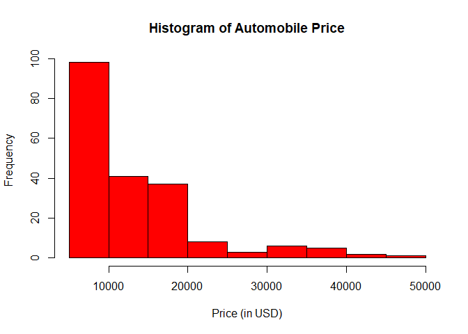

#### Description:

Most of the automobiles are in the price range $5000 to $10,000. On average, we can see a decreasing pattern with little noise.

#### Boxplot of horsepower in horizontal orientation

``` r
boxplot(automobile$horsepower, horizontal = TRUE, range = 1.5, col ="yellow" , border = "purple" )
```

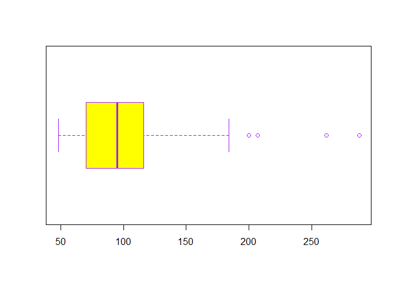 \#\#\#\# Description of the Boxplot

Boxplot gives the five important numbers namely, the minimum value (48 HP), maximum value (288 HP), first quartile (70 HP), median or the second quartile (95 HP) and the third quarile (116 HP). The first and the third quartile are connect with a box which are followed by whiskers which are of length 1.5 interquartile range from the median. Whiskers are followed by the outliers that lie between the whiskers and the minimum or maximum value. In this plot we dont see any outliers in the lower end but certainly few in the upper range. It shows that the data is skewed to left and not symmetric. The right tail is ligher than the left tail. And thus we can anticipate that the mean would be higher than the median.

#### Barplot of frequencies of body\_style, arranged in decreasing order

``` r
counts <- sort(table(automobile$body_style), decreasing = TRUE)
barplot(counts, beside = TRUE, width = 2, main = "Frequency distribution of Body Styles", xlab = "Body Style of the Vehicle", ylab = "Number of Vehicles", col = "blue", cex.names = 0.65)
```

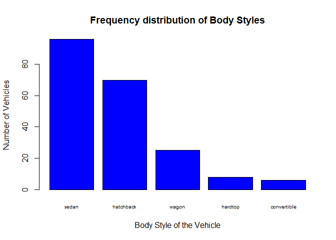

#### Decription of the Bar Plot

Using the barplot we find that most vehicles are sedan(96), followed by hatchback(70). Wagons (25) lag hatchback by quite a big margin and hardtop(8) and convertibles(5) are rare.

#### Stars() plot of vehicles with turbo aspiration, using only variables wheel-base, length, width, height, and price.

``` r
stars(automobile[automobile$aspiration=="turbo", c("wheel_base", "length", "width", "height", "price" )], full = TRUE, scale = TRUE, key.labels =c("wheel_base", "length", "width", "height", "price" ) )
```

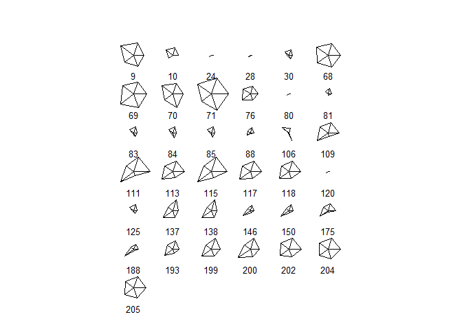 \#\#\#\# Description for stars() plot

We see that vehicle of the row number 24 28, 80, 81 and 120 are comparatively quite small in all the aspects of wheel base size, length, width, height and price. There seem to be a positive correlation between all these attributes. Visually we can also make out that vehicle of row 71 is the largest amongst all (in size as well as price).

Summaries
=========

#### a. What is the mean orice of fuel\_type gas cars? And what is the mean price of fuel\_type diesel cars? (removing missing values)

``` r
gas_price <- automobile[automobile$fuel_type=="gas", "price"]
mean_price_gas <- mean(gas_price, na.rm = TRUE, trim = 0)
mean_price_gas
```

    ## [1] 12916.41

``` r
diesel_price <- automobile[automobile$fuel_type=="diesel", "price"]

mean_diesel_price <- mean(diesel_price, na.rm = TRUE, trim = 0)
mean_diesel_price
```

    ## [1] 15838.15

The mean price of fuel\_type gas cars is $12916.41 while the mean price of fuel\_type diesel cars is $15838.15.

#### b. What is the make of the car with twelve num\_of\_cylinders?

``` r
make_of_twelve_cyl <- automobile[automobile$num_of_cylinders=="twelve", "make"]
 make_of_twelve_cyl
```

    ## [1] "jaguar"

Jaguar is the make of the car with twelve num\_of\_cyclinders.

#### c. What is the make that has the most diesel cars?

``` r
diesel_make <- automobile[automobile$fuel_type=="diesel", "make"]
t_diesel_make <- table(diesel_make)
t_diesel_make
```

    ## diesel_make
    ##         mazda mercedes-benz        nissan        peugot        toyota 
    ##             2             4             1             5             3 
    ##    volkswagen         volvo 
    ##             4             1

``` r
df_diesel_make <- as.data.frame(t_diesel_make)
df_diesel_make
```

    ##     diesel_make Freq
    ## 1         mazda    2
    ## 2 mercedes-benz    4
    ## 3        nissan    1
    ## 4        peugot    5
    ## 5        toyota    3
    ## 6    volkswagen    4
    ## 7         volvo    1

``` r
max_diesel_make <- df_diesel_make[df_diesel_make$Freq==max(df_diesel_make$Freq), ]
max_diesel_make
```

    ##   diesel_make Freq
    ## 4      peugot    5

The make that has the most diesel cars is Peugot that produces 5 types of diesel cars.

#### d. What is the price of the car with the largest amount of the horsepower?

``` r
price_maxHP <- automobile[automobile$horsepower==max(automobile$horsepower, na.rm = TRUE), c("price", "horsepower")]
price_maxHP
```

    ##      price horsepower
    ## 130     NA        288
    ## NA      NA         NA
    ## NA.1    NA         NA

``` r
second_maxHP <- head(sort(automobile$horsepower, decreasing = TRUE), 3)
second_maxHP
```

    ## [1] 288 262 207

``` r
automobile[automobile$horsepower==second_maxHP, c("price", "horsepower") ]
```

    ## Warning in automobile$horsepower == second_maxHP: longer object length is
    ## not a multiple of shorter object length

    ##      price horsepower
    ## 50   36000        262
    ## 129  37028        207
    ## 130     NA        288
    ## NA      NA         NA
    ## NA.1    NA         NA

So the price of the car with the maximum horsepower (288 HP) is missing from the data we have. Therefore it s showing NA. So, we go ahead with finding the price of car with the second maximum and the third maximum horsepower (262 HP and 207 HP) and find the price to be $36000 and $37028 respectively.

#### e. What is the bottom 10th percentile of city\_mpg?

``` r
quantile(automobile$city_mpg, probs = 0.1)
```

    ## 10% 
    ##  17

The bottom 10th percentile of the city\_mpg is 17 miles per gallon.

#### f. What is the top 10th percentile of highway\_mpg?

``` r
quantile(automobile$highway_mpg, probs = 0.9)
```

    ## 90% 
    ##  38

The top 10th percentile of the highway\_mpg is 38 miles per gallon.

#### g. What is the median price of those cars in the bottom 10th percetile of city\_mpg?

``` r
sub10_city_mpg <- automobile[automobile$city_mpg <= quantile(automobile$city_mpg, 0.10), c("city_mpg", "price")]
sub10_city_mpg
```

    ##     city_mpg price
    ## 9         17 23875
    ## 10        16    NA
    ## 16        16 30760
    ## 17        16 41315
    ## 18        15 36880
    ## 48        15 32250
    ## 49        15 35550
    ## 50        13 36000
    ## 56        17 10945
    ## 57        17 11845
    ## 58        17 13645
    ## 59        16 15645
    ## 72        16 34184
    ## 73        16 35056
    ## 74        14 40960
    ## 75        14 45400
    ## 102       17 13499
    ## 103       17 14399
    ## 106       17 19699
    ## 127       17 32528
    ## 128       17 34028
    ## 129       17 37028
    ## 130       17    NA
    ## 199       17 18420
    ## 200       17 18950

``` r
med_price <- median(sub10_city_mpg$price, na.rm = TRUE)
med_price
```

    ## [1] 32250

The median price of those cars in the bottom 10th percentile of city\_mpg is $32250.

Technical Questions about Data Frames
=====================================

#### a. What happens when you use the dollar $ operator on a data frame, attempting to use the name of a column that does not exist? For example dat$xyz where there is no column named xyz.

Ans a. Since there is no column that exists with the name we are calling in the dataframe, the R returns NULL that is returns nothing.

#### b. Which of the following commands fails to return the vector mpg which is a column in the built-in data frame mtcars:

Ans b 1. mtcars$mpg : Returns  2. mtcars\[ , 1\] : Returns  3. mtcars\[\[1\]\] : Returns  4. mtcars\[ ,mpg\] : Fails, because the column name mpg must be enclosed in quotation mark.  5. mtcars\[\["mpg"\]\] : Returns  6. mtcars$"mpg" : Returns
7. mtcars\[ ,"mpg"\] : Returns

#### c. Based on your answer in part b, what is the reason that makes such command to fail?

Ans c. The reason it fails is that the argument expects the index of thecolumn if there are no quotation marks and i expects the name of the column only if if it in the quotation mark which makes it a string rather than num.

#### d. Can you include an R list as a "column" of a dataframe&gt; YES or NO and Why?

Ans d. Yes, we can include R list as a "column" of a dataframe because data frames are also a type of list. If the number of elements of the list is less than the number of rows in the column of the data frame, then the elements of the list recycles to make the number of elements equal to the number of the rows of the data frame. We must keep in mind that the columns of a data frame are homogeneous or atomic while the elements of the list are not.

#### e. What happens when you apply as.list() to a data frame?

Ans e. When we apply as.list() to a data frame, the data frame gets converted to a list with each column of the data frame as each element of the list.

#### f. Consider the command: abc &lt;- as.list(mtcars). What functions can you use to convert the object abc into a data frame.

Ans To convert the object abc to data frame, following functions can be used: 1. as.data.frame(mtcars)

1.  data.frame(mtcars)

2.  enframe(mtcars) (from package tibble) etc.

7. Correlations of quantitative variables
=========================================

``` r
qdat <- na.omit(automobile[ , -c(1, 2, 3, 4, 5, 6, 7, 8 , 9, 15, 16, 18)])
qdatc <- round(cor(qdat), 2)
corrplot(qdatc, method = "circle")
```

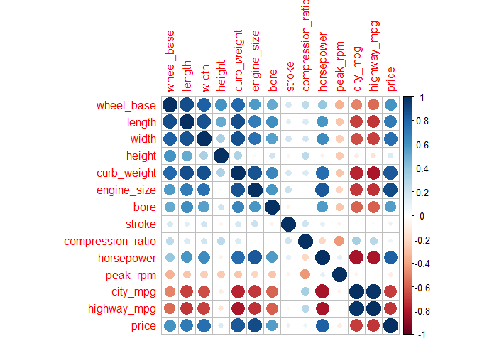

``` r
corrplot(qdatc, method = "pie")
```

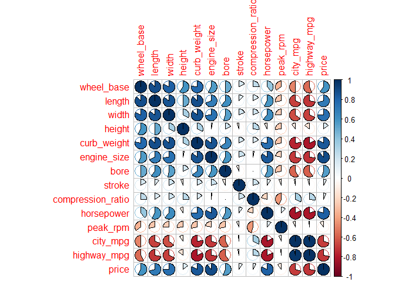

``` r
corrplot(qdatc, method = "color")
```

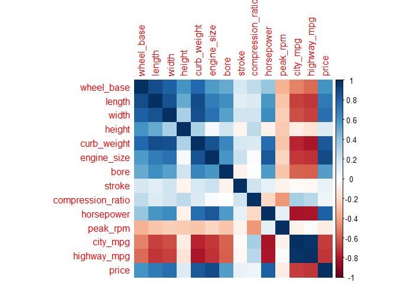

``` r
corrplot(qdatc, method = "number")
```

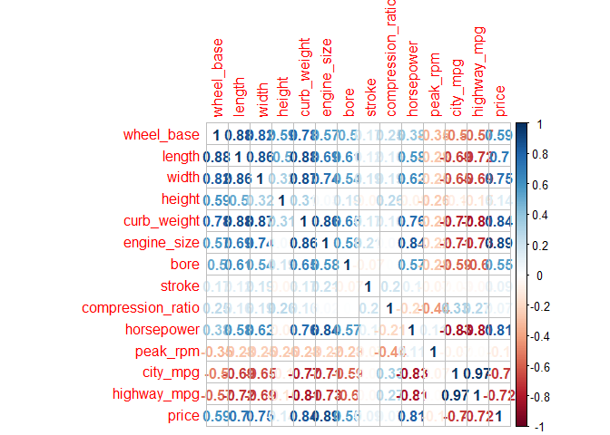

``` r
corrplot.mixed(qdatc, lower = "number", upper = "shade", lower.col = "black", number.cex= 0.5, tl.pos = "lt", diag = "u" )
```

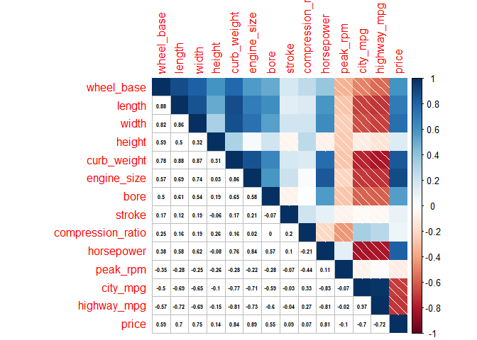

``` r
#Reordering the correlation matrix
corrplot(qdatc, type = "upper", order = "hclust")
```

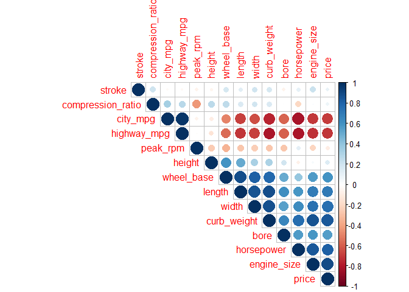 Based on the matrix of correlation "qdat" between the quantitative variables and the correlogram, we make the following observations:

1.  All the diagonal elements have the correlation 1 (i.e. the correlation of a element with itself is 1)

2.  The correlogram matrix is symmetric along the diagonal.

3.  In order to distinguish between the positive and negative correlations, two distinct colors are used.

4.  Length & width, wheel base & length, curb\_weight & engine size are all positively correlated with high intensity which is what we expect.

5.  Compression ratio is not very heavily correlated to any variables.

6.  city miles per gallon and highway miles per gallon are highly correlated positively to each other.

7.  However, city\_mpg and highway\_mpg are both negatively correlated to all the attributes that increase weight of the car like wheel base, length, width, height, engine size, bore which justifies the principals of mechanics.

8. Principal Components Analysis
================================

8.1) Run PCA
------------

#### Use prcomp() to perform a principal components analysis on qdat; use the argument scale. =TRUE to carry out PCA on standardized data

``` r
#PCA with prcomp()
pca_prcomp <- prcomp(qdat, scale. = T)

#Inside the prcomp
names(pca_prcomp)
```

    ## [1] "sdev"     "rotation" "center"   "scale"    "x"

``` r
#Eigen Values
eigenvalues <- pca_prcomp$sdev^2
eigenvalues
```

    ##  [1] 7.53181553 2.27923094 1.21613308 0.90961519 0.60894217 0.41570430
    ##  [7] 0.32059895 0.27014548 0.12030933 0.11060092 0.08158813 0.06422049
    ## [13] 0.05139667 0.01969881

``` r
# loadings or weights
loadings <- pca_prcomp$rotation
round(loadings, 3)
```

    ##                      PC1    PC2    PC3    PC4    PC5    PC6    PC7    PC8
    ## wheel_base         0.288 -0.292  0.130 -0.240  0.040 -0.091  0.293 -0.295
    ## length             0.328 -0.163  0.127 -0.147  0.007 -0.003  0.228 -0.017
    ## width              0.324 -0.126 -0.052 -0.093 -0.129 -0.124  0.459 -0.197
    ## height             0.111 -0.400  0.476 -0.392  0.002  0.082 -0.605  0.026
    ## curb_weight        0.352 -0.062 -0.054  0.015 -0.057 -0.046  0.013  0.136
    ## engine_size        0.322  0.081 -0.250  0.182 -0.084 -0.175 -0.269 -0.241
    ## bore               0.259  0.004  0.166  0.394  0.317  0.764  0.029 -0.223
    ## stroke             0.052 -0.115 -0.704 -0.479  0.433  0.194 -0.136 -0.014
    ## compression_ratio  0.015 -0.520 -0.284  0.168 -0.499  0.316  0.066  0.476
    ## horsepower         0.298  0.302 -0.141  0.086 -0.131  0.065 -0.240  0.053
    ## peak_rpm          -0.081  0.446  0.058 -0.527 -0.490  0.441  0.122 -0.124
    ## city_mpg          -0.309 -0.272 -0.114  0.086 -0.155  0.034 -0.028 -0.459
    ## highway_mpg       -0.319 -0.222 -0.115  0.088 -0.141  0.063 -0.061 -0.470
    ## price              0.319  0.070 -0.135  0.107 -0.366 -0.110 -0.335 -0.266
    ##                      PC9   PC10   PC11   PC12   PC13   PC14
    ## wheel_base         0.318 -0.404  0.352 -0.409 -0.102  0.092
    ## length             0.448  0.277 -0.647  0.170 -0.153 -0.164
    ## width             -0.660  0.362  0.100  0.077 -0.059  0.023
    ## height            -0.179  0.164  0.096  0.069 -0.038  0.012
    ## curb_weight        0.183  0.058  0.161  0.219  0.850  0.109
    ## engine_size        0.212 -0.018  0.320  0.569 -0.383  0.088
    ## bore              -0.095 -0.071  0.004  0.040  0.009 -0.006
    ## stroke            -0.073 -0.025 -0.084 -0.025  0.020 -0.023
    ## compression_ratio  0.030 -0.071  0.064 -0.025 -0.170  0.030
    ## horsepower         0.180  0.544  0.184 -0.579 -0.072 -0.088
    ## peak_rpm           0.076 -0.067  0.078  0.177  0.013  0.021
    ## city_mpg           0.100  0.139  0.142  0.037  0.186 -0.698
    ## highway_mpg        0.128  0.279 -0.165 -0.080  0.097  0.665
    ## price             -0.268 -0.436 -0.459 -0.209  0.117 -0.068

``` r
#scores or principal components
scores <- pca_prcomp$x
round(head(scores, 5), 3)
```

    ##      PC1   PC2    PC3    PC4    PC5    PC6    PC7   PC8    PC9   PC10
    ## 1 -0.611 2.159  0.298  2.430 -0.194 -0.116  0.499 0.976  0.153 -0.205
    ## 2 -0.493 2.185  0.248  2.470 -0.330 -0.157  0.374 0.877  0.053 -0.368
    ## 3  0.443 1.362 -1.446 -0.625 -0.359 -1.997 -0.726 1.326  0.199  0.477
    ## 4 -0.179 0.256 -0.066 -1.150 -0.277  0.118  0.175 0.091 -0.163 -0.091
    ## 5  1.267 1.164 -0.019 -1.201 -0.048 -0.331 -0.128 0.709 -0.251 -0.414
    ##     PC11   PC12   PC13   PC14
    ## 1 -0.445  0.357  0.153 -0.017
    ## 2 -0.616  0.279  0.197 -0.042
    ## 3  0.029 -0.347  0.086  0.132
    ## 4 -0.287 -0.234 -0.259 -0.025
    ## 5 -0.051  0.156  0.103 -0.069

#### Examine the eigenvalues and determine the proportion of variation that is "captured" by the first three components.

``` r
#Eigen Values
eigenvalues <- pca_prcomp$sdev^2

eigs <- eigenvalues
eigs_perc <- 100*eigs/sum(eigs)

eigs_cum <- cumsum(eigs_perc)

eigs_df <- data.frame(
  eigenvalue = eigs,
  percentage = eigs_perc,
  "cumulative percentage" = eigs_cum
)

print(round(eigs_df, 4), print.gap = 2)
```

    ##     eigenvalue  percentage  cumulative.percentage
    ## 1       7.5318     53.7987                53.7987
    ## 2       2.2792     16.2802                70.0789
    ## 3       1.2161      8.6867                78.7656
    ## 4       0.9096      6.4973                85.2628
    ## 5       0.6089      4.3496                89.6124
    ## 6       0.4157      2.9693                92.5817
    ## 7       0.3206      2.2900                94.8717
    ## 8       0.2701      1.9296                96.8013
    ## 9       0.1203      0.8594                97.6607
    ## 10      0.1106      0.7900                98.4507
    ## 11      0.0816      0.5828                99.0335
    ## 12      0.0642      0.4587                99.4922
    ## 13      0.0514      0.3671                99.8593
    ## 14      0.0197      0.1407               100.0000

The Eigen values capture the projected inertia (i.e.) variation on each extracted dimension. In our case, where the data frame "qdat" is standardised, the sum of eigenvalues equals the number of variables. Thus we compute the proportion of variation captured by each PC by dividing the eigenvalues by the total inertia.

We observe that the first three components capture the maximum proportion of variation. The proportion of variation of the first three components is approximately 53.8%, 16.28% and 8.69% respectively. Together, the first three components alone capture about 79% proportion of variation.

8.2) PCA plot of vehicles, and PCA plot of variables
----------------------------------------------------

#### Use the first two components to graph a scatterplot of the vehicles.

``` r
plot(pca_prcomp$x, type = "n", las = 1)
abline(h=0, v=0)
points(pca_prcomp$x[, 1], pca_prcomp$x[ ,2], pch = 19, col = "#88888877")
title(main = "PC Plot of the vehicles")
```

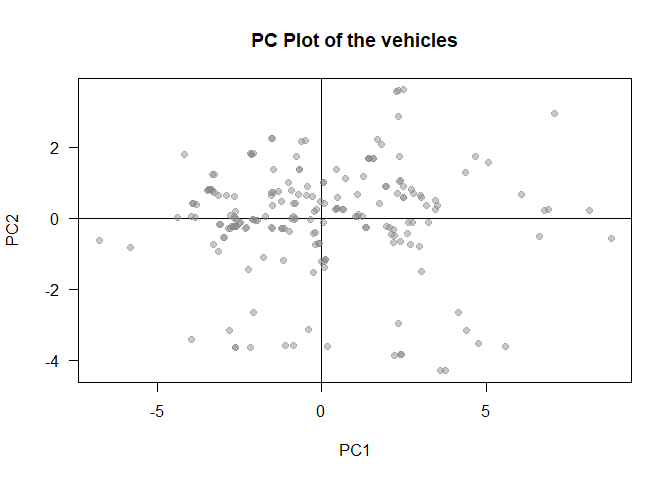

#### Use the first two loadings (i.e. eigen vectors) to graph the variables

``` r
loadings <- pca_prcomp$rotation
loadings
```

    ##                           PC1          PC2         PC3         PC4
    ## wheel_base         0.28820539 -0.291822882  0.12994231 -0.24040455
    ## length             0.32846158 -0.163361793  0.12744458 -0.14708138
    ## width              0.32387774 -0.125794575 -0.05159710 -0.09327862
    ## height             0.11093310 -0.399505972  0.47616754 -0.39155982
    ## curb_weight        0.35188704 -0.061690513 -0.05439206  0.01531897
    ## engine_size        0.32195403  0.080699454 -0.25006815  0.18207249
    ## bore               0.25921783  0.003813116  0.16639019  0.39377173
    ## stroke             0.05246970 -0.114613607 -0.70435429 -0.47906205
    ## compression_ratio  0.01456148 -0.520135281 -0.28357924  0.16841754
    ## horsepower         0.29789335  0.301937846 -0.14137051  0.08579386
    ## peak_rpm          -0.08117128  0.446147534  0.05814015 -0.52744444
    ## city_mpg          -0.30909009 -0.272494571 -0.11401133  0.08571829
    ## highway_mpg       -0.31920231 -0.222155076 -0.11501526  0.08841510
    ## price              0.31851813  0.069950904 -0.13480231  0.10734760
    ##                            PC5          PC6         PC7         PC8
    ## wheel_base         0.040390152 -0.091044654  0.29280991 -0.29480758
    ## length             0.007462052 -0.003281959  0.22826758 -0.01685486
    ## width             -0.128866810 -0.123638324  0.45853571 -0.19737255
    ## height             0.001618322  0.081959274 -0.60515036  0.02555923
    ## curb_weight       -0.057461684 -0.045545593  0.01314028  0.13585260
    ## engine_size       -0.083906981 -0.175158702 -0.26926446 -0.24075452
    ## bore               0.317119243  0.763826825  0.02922983 -0.22251589
    ## stroke             0.433100016  0.194370109 -0.13551220 -0.01413997
    ## compression_ratio -0.498544456  0.316232642  0.06588965  0.47639736
    ## horsepower        -0.131012718  0.065151100 -0.23999786  0.05342361
    ## peak_rpm          -0.489851393  0.440721180  0.12239852 -0.12411071
    ## city_mpg          -0.155027565  0.034015804 -0.02754798 -0.45872657
    ## highway_mpg       -0.140578296  0.063399817 -0.06133115 -0.46950783
    ## price             -0.365732305 -0.109866699 -0.33519865 -0.26642750
    ##                           PC9        PC10         PC11        PC12
    ## wheel_base         0.31803097 -0.40383755  0.352478872 -0.40884789
    ## length             0.44759966  0.27680872 -0.647147529  0.17005108
    ## width             -0.66047755  0.36152498  0.099554205  0.07695175
    ## height            -0.17854610  0.16431334  0.096188616  0.06889848
    ## curb_weight        0.18337772  0.05790402  0.161246477  0.21907848
    ## engine_size        0.21247520 -0.01837147  0.320178658  0.56903676
    ## bore              -0.09483889 -0.07068087  0.003634347  0.03958635
    ## stroke            -0.07256394 -0.02523594 -0.084270274 -0.02514953
    ## compression_ratio  0.03006785 -0.07136841  0.064175833 -0.02516110
    ## horsepower         0.17987925  0.54412613  0.184023017 -0.57937605
    ## peak_rpm           0.07551295 -0.06706146  0.077802479  0.17709794
    ## city_mpg           0.10042010  0.13943000  0.142429780  0.03719344
    ## highway_mpg        0.12840259  0.27943585 -0.164571125 -0.08029781
    ## price             -0.26801914 -0.43598268 -0.459085844 -0.20917748
    ##                           PC13         PC14
    ## wheel_base        -0.101872047  0.092324032
    ## length            -0.152920764 -0.164388742
    ## width             -0.059479953  0.022591691
    ## height            -0.037851269  0.012020057
    ## curb_weight        0.849862076  0.109225303
    ## engine_size       -0.382542972  0.088442773
    ## bore               0.009110184 -0.005699296
    ## stroke             0.020361037 -0.022922714
    ## compression_ratio -0.170130520  0.030438648
    ## horsepower        -0.072408918 -0.087583765
    ## peak_rpm           0.012866553  0.020721489
    ## city_mpg           0.186412547 -0.698240708
    ## highway_mpg        0.096685755  0.665040758
    ## price              0.117105656 -0.068127984

``` r
#Optional graph made
```

#### Optionally, you can call biplot() of the "prcomp" object to get a simultaneous plot of both the vehicles and the variables.

``` r
biplot(pca_prcomp, scale = 0, cex=0.7)
```

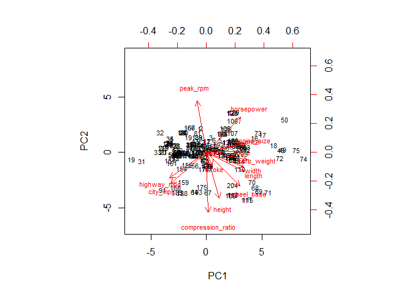

In the biplot, the top and the right axes shows loadings of variables (i.e. each characteristic/attribute of the vehicle) while the left and the bottom axes represent scale for the score of each vehicle that is normalised principal component score.

In this case, we observe that variables length, width, curb\_weight are quite close together is space. So if a vehicle has high length, it is likely to have a high width / curb\_weight as well. Similarly, we see that city\_mpg and highway\_mpg are close together in space. So a vehicle with high city mileage is likely to have a high highway mileage as well.. Similarly there is high correlation between engine size and the price of the vehicle. We can also infer from the plots that the horsepower and the mileage (both city and highway) are negatively correlated which means that if a vehicle has high horsepower, it probably has low city\_mpg and low highway\_mpg. For the plot of vehicle with respect to first two components, we see that most vehicles are clustered in the middle region so as to mantain the aspect ratio of the vehicle. But, we can also find some outliers such as vehiclke number 74 and 75 with a high wheel base but a relative low length. On the contrary, we find other extreme vehicles such as 19 and 31 that have low wheel base and good length relatively. Vehicles 115 and 111 also are a bit of outlier for having low length and while vehicles like 112 stand out for higher component of PC2.
